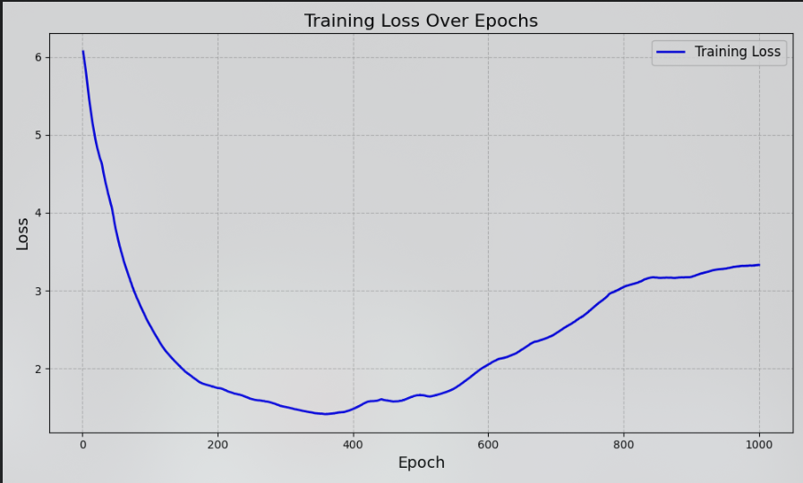
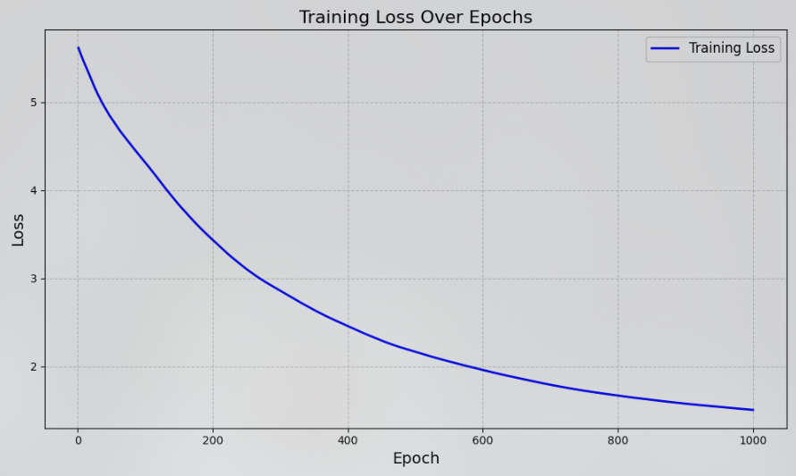
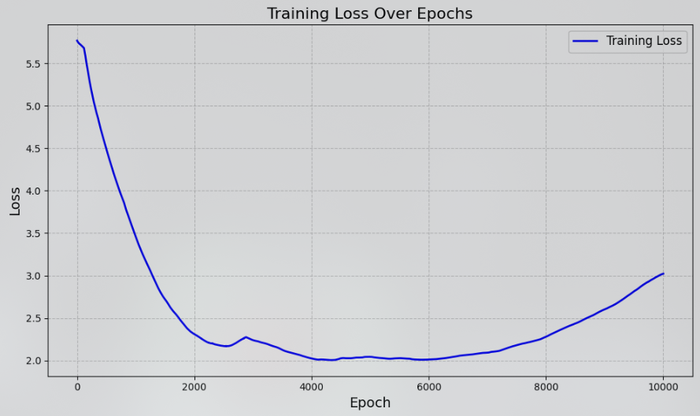
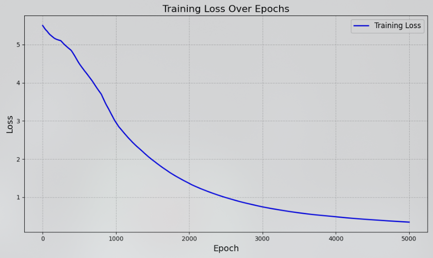
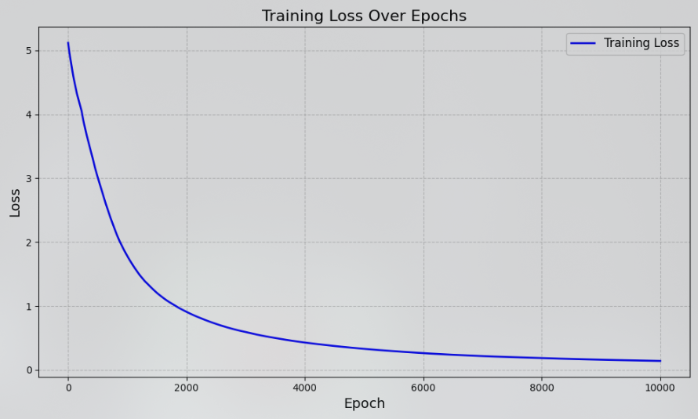
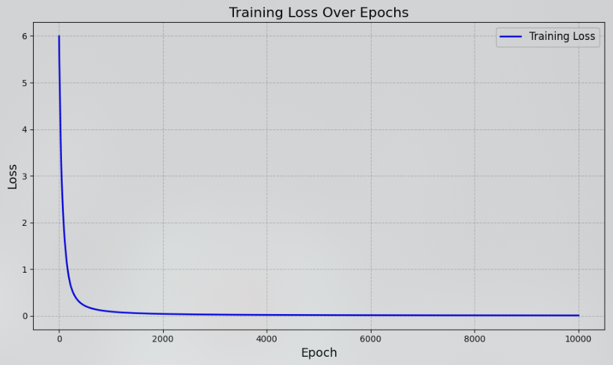

# Hyperparameter Tuning: Choosing the Learning Rate (`eta`)

## Overview

Hyperparameter tuning is a crucial step in optimizing the performance of our neural network. In this document, we focus on the learning rate (`eta`), which plays a vital role in determining how quickly the model converges during training.

Choosing an appropriate learning rate ensures that the model learns efficiently without overshooting the optimal solution or converging too slowly.

---

## Why the Learning Rate (`eta`) Matters

The learning rate controls the size of the steps the optimizer takes to minimize the loss function. 
- A **small `eta`** can lead to slow convergence and prolonged training times.
- A **large `eta`** can cause the model to oscillate or even diverge.

Hence, finding the optimal `eta` is a balance between speed and stability.

---

## Methodology

To determine the best learning rate, we performed:

- A **grid search** across several `eta` values: `[0.0001, 0.001, 0.01, 0.1, 1.0]`.
- **Training on sample datasets** with varying levels of complexity.
- **Tracking metrics** such as training loss, validation accuracy, and convergence speed.

As we can set different values for the full layers and the convolutional layers, we did multiple tests.

---

## Results

The results of our experiments are summarized in the following plots:

### Training Loss vs. Epochs

**Description**: This plot shows how the training loss decreases over epochs for different values of `eta`.

1.
    - `eta = 0.01` conv layers
    - `eta = 0.01` full layers
    - The loss goes down quickly but is really instable.
    - 

2.
    - `eta = 0.01` conv layers
    - `eta = 0.001` full layers
    - The loss goes down a bit slow but is more stable.
    - 

3.
    - `eta = 0.01` conv layers
    - `eta = 0.001` full layers
    - The loss goes down even more slowly and isn't stable.
    - 

4.
    - `eta = 0.01` conv layers
    - `eta = 0.0001` full layers
    - The loss takes a long time to go down.
    - 

5.
    - `eta = 0.01` conv layers
    - `eta = 0.0001` full layers
    - The loss goes down fast enought and is quite stable.
    - 

6.
    - `eta = 0.1` conv layers
    - `eta = 0.001` full layers\
    - The loss goes down super fast and is perfectly stable.
    - 

## Conclusion

Based on our experiments:
- We selected `eta = 0.1` for convolutional layers and `eta = 0.001` for full layers  as the optimal learning rate for our model.
- It offers a good balance between convergence speed and model stability.

---
