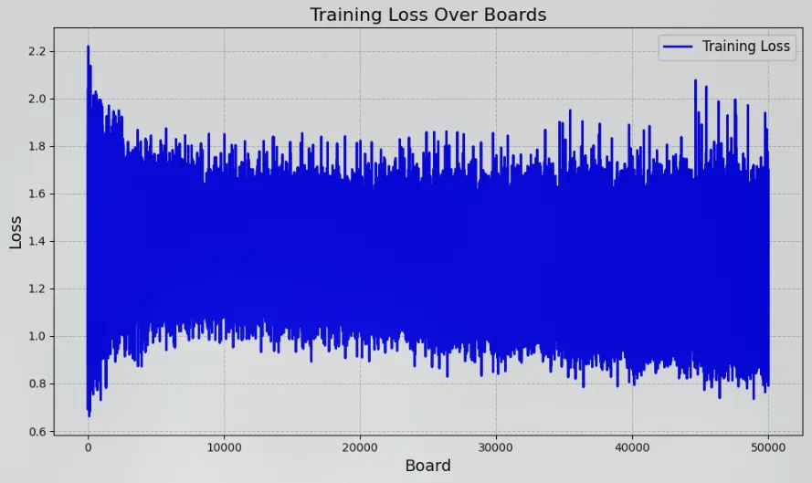

# ♟️ my_torch Project ♟️

## Overview

The **my_torch** is a machine-learning-based solution designed to generate and analyze neural networks. It provides two primary functionalities:

1. **Neural Network Generator**: Creates new neural networks based on configuration files.
2. **Chessboard Analyzer**: Operates in two modes:
   - **Training Mode**: Trains a neural network with labeled chessboard data.
   - **Evaluation Mode**: Evaluates chessboards and predicts their state based on a trained network.

The project adheres to supervised learning principles and delivers a complete pipeline for generating, training, and evaluating neural networks. A pre-trained model named `my_torch_network.nn` is included.

---

## Project Structure

The project is organized as follows:

```
my_torch/
├── analyzer/            # Source code for the analyzer
├── assets/              # Doc assets
├── generator/            # Source code for the generator
├── neural_network/      # Source code for the neural network class
├── pretrained/          # Pre-trained models, including 'my_torch_network'
├── temp/                # temporary files for testing
├── my_torch_analyzer.py   # Main file for analyzer
├── my_torch_generator.py  # Main file for generator
├── .conf.example        # Example of a config file that can be used with the generator
├── README.md            # Project documentation (this file)
└── HyperTuning.md       # Documentation on our choice of hyperparameters
```

---

## Features

### Neural Network Generator

The neural network generator reads one or more configuration files and creates new neural networks. Each configuration file describes the architecture and hyperparameters of the neural network. You can specify multiple configuration files and generate multiple networks for each configuration.

**Usage**:

```bash
./my_torch_generator <config_file_1> <nb_1> [<config_file_2> <nb_2> ...]
```

- **`config_file_i`**: Path to a configuration file containing the neural network description.
- **`nb_i`**: Number of networks to generate based on `config_file_i`.

Example:

```bash
./my_torch_generator tat.conf 5 toto.conf 3
```

This command generates 5 networks from `tata.conf` and 3 networks from `toto.conf`.

### Chessboard Analyzer

The chessboard analyzer processes chessboard positions in **Forsyth–Edwards Notation (FEN)** and outputs predictions. It supports two modes:

#### Training Mode

- Trains the neural network using labeled chessboard data in **FEN** notation.
- Saves the trained model to a file.

**Usage**:

```bash
./my_torch_analyzer --train [--save <output_model>] <load_file> <training_data>
```

- **`<output_model>`**: Filename to save the trained model, if not set the model will be saved in ``<load_file>``
- **`<load_file>`**: Path to the initial model file.
- **`<training_data>`**: File containing labeled chessboard data in FEN notation.

#### Evaluation Mode

- Evaluates chessboard positions using a pre-trained model.
- Outputs predictions in the same order as the input.

**Usage**:

```
./my_torch_analyzer --predict <load_file> <input_data>
```

- **`<load_file>`**: Path to the trained model.
- **`<input_data>`**: File containing chessboard positions in FEN notation.

---

## Training a Neural Network

To train your neural network:

1. Prepare a dataset in FEN format. Each line should contain an input (FEN position) and the expected output.
2. Run the analyzer in training mode:

   ```bash
   ./my_torch_analyzer --train --save my_torch_network <load_file> <training_data>
   ```

3. The trained model will be saved as `my_torch_network`.

---

## Benchmarking and Results

We conducted extensive benchmarking to select optimal hyperparameters, including:

- **Learning Rate (`eta`)**: Determined through grid search (go check this [doc](./HyperTuning.md)).
- **Number of Layers and Neurons**: Evaluated for performance vs. complexity.
- **Evaluation method**: Function to use by the differents layers to compute the neurons.

### Key Results

- Training converges fastest with `eta = 0.1` for convolutional layers and `eta = 0.001` for full layers.
- Validation accuracy peaks with a 4-layer architecture two convolutional layers and 2 full layers (832 and 512 neurons).
- The best evaluation method (between `linear`, `sigmoid`, `relu` and `leaky_relu`) was `leaky_relu`, with wich we get the best results

## Pre-Trained Model

A pre-trained neural network is included in the `pretrained/` directory:
- **Filename**: `my_torch_network.nn`
- **Description**: This model was trained on a dataset of chessboard positions and is optimized for evaluating chessboard states.

To use this model:

```bash
./my_torch_analyzer --predict pretrained/my_torch_network.nn <input_data>
```

Here is a graph of the result of this model.

